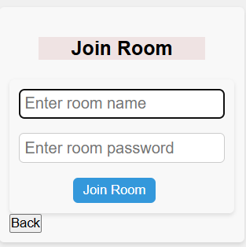

# myChat

### 关于本项目

​	目前大一再读, 这个项目是在我课余时间结合自己学的一些东西写的, 本身不算完善, 和别人的项目比起来也显得简陋, 权当是自己兴趣+练手, 也是记录自己成长的一部分.

​	写这个感觉可以帮助我自己熟悉一些基本的开发流程, 为以后的复杂项目积累经验. 在这个过程中自己学到了很多课堂上或是只看网课学不到的宝贵经验, 边写边学习, 自己到处查资料＋问ai的过程也让我有了许多体会.

​	本来准备先fork别人的项目(想找一个简单的**全栈入门**项目), 结果发现比想象中的麻烦, 于是就直接自己动手写了.

​	本项目是一个**线上实时聊天室**,目前只做了很基本的功能:

- 创建用户

- 用户登录

- 创建聊天室

- 加入自己或者他人的聊天室


- 线上实时聊天


其余各种功能添加和优化之后有机会就找时间开工,现在课业有点繁重.


#### 技术栈

前端: vue3,	vuex,	vue-cli,	axios,	JavaScript,	css.

后端: node.js,	koa2,	mysql,	jwt授权,	websocket和socket.io实现通信 


### 初始设置

#### 在工作目录

```bash
npm install

npm run dev
```

#### 数据库表结构

```sql
#用户表
CREATE TABLE users(
	id int auto_increment primary key comment "用户id唯一标识",
    username varchar(255) not null unique comment "用户名",
    password varchar(255) not null "密码",
    create_at timestamp current_timestamp comment "创建时间"
)

#房间表
CREATE TABLE rooms(
	id int auto_increment primary key comment "房间id唯一标识",
    name varchar(255) not null unique comment "房间名",
    password varchar(255) not null comment "房间密码"
    create_at timestamp current_timestamp comment "创建时间"
)

#用户房间关联表
#使用逻辑外键
CREATE TABLE user_rooms(
	id int auto_increment primary key comment "记录id唯一标识",
    user_id int not null,
    room_id int not null,
    joined_at timestamp current_timestamp comment "用户加入房间的时间"
)

#消息表
CREATE TABLE messages(
	id int auto_increment primary key comment "消息id唯一标识",
    room varchar(255) not null comment "所处房间",
    user varchar(255) not null comment "发送用户",
    text text not null comment "消息内容",
    timestamp datetime current_timestamp comment "发送时间" 
)
```


